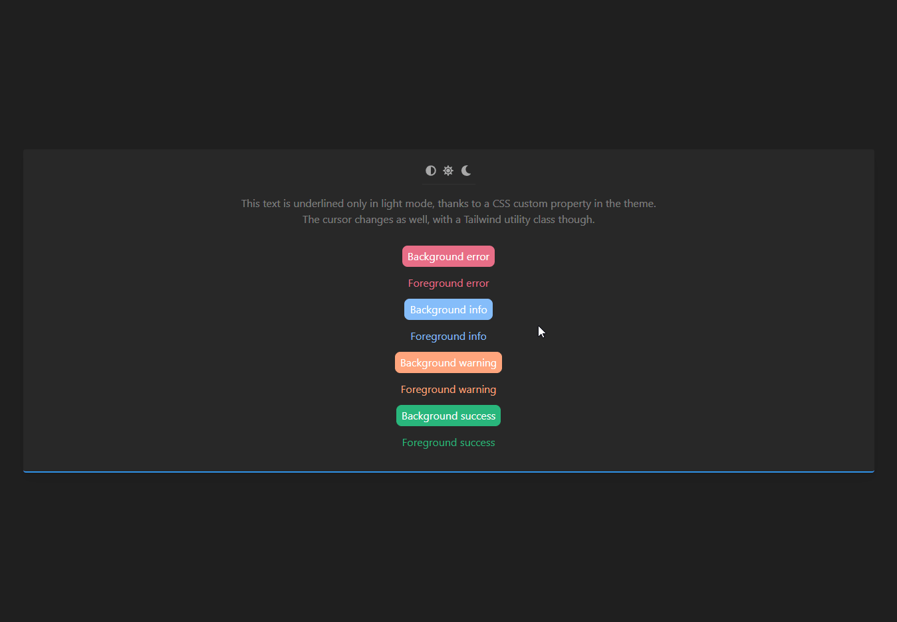

<p align="center">
  
</p>

# Table of contents

- [Transitions](#transitions)
    - [Configuration](#configuration)
    - [Application](#application)
- [← Back](../readme.md)

# Transitions

It is advised to use this plugin with [benface's tailwindcss-transitions](https://github.com/benface/tailwindcss-transitions). With it, you can make smooth transitions between themes:

```html
<body class="transition-all transition-250" data-theme="light">
  <!-- /// -->
</body>
```

<p align="center">
  
    <i>Yeah, this is a GIF. The FPS is not on point, but I swear it's smoooooth.</i>
</p>

# Configuration

This example showcase a configuration which defines a default and a dark theme, both of which are assignable and have a set of variants. 
The dark theme inherits some of the opacity variants of the main theme. 

The main theme is named `light` and is assignable with `[data-theme="light"]`. The dark theme will be applied by default if the `prefers-color-scheme` media query is `dark`, but the `dark` theme is still assignable with `[data-theme="dark"]`.

```js
const { ThemeBuilder, Theme } = require('tailwindcss-theming');

const lightTheme = new Theme()
  .name('light')
  .default()
  .assignable()
  .colors({
    // A transparent color, which alpha value will be detected.
    'transparent': 'transparent',

    // Navigation
    'navigation-primary': '#3c4253',
    'navigation-secondary': '#303030',
    'on-navigation': '#9aa2b6',

    // Brand colors
    'brand':'#2196f3',
    'brand-variant':'#1565c0',
    'on-brand':'#ffffff',
    'on-brand-variant':'#ffffff',
    
    // Background colors, but not limited to `bg` utilities.
    'background':'#f4f4f4',
    'surface':'#ffffff',
    'on-background':'#585851',
    'on-surface':'#3c3c3c',
    
    // Event colors.
    'error':'#b00020',
    'on-error':'#ffffff',
    'success':'#3ab577',
    'on-success':'#ffffff',
    'warning':'#e65100',
    'on-warning':'#ffffff',
    'info':'#2481ea',
    'on-info':'#ffffff',
  })

  // Color variants
  .colorVariant('hover', 'white', ['on-navigation'])

  // Material variants
  .opacityVariant('high-emphasis', .87)
  .opacityVariant('medium-emphasis', .60)
  .opacityVariant('disabled', .38)
  .opacityVariant('helper-emphasized', .87)
  .opacityVariant('helper', .6)
  .opacityVariant('inactive', .6)

  // Arbitrary variants
  .opacityVariant('quote-border', .5)
  .opacityVariant('muted', .38)
  .opacityVariant('kinda-visible', .1)
  .opacityVariant('slightly-visible', .075)
;

const darkTheme = new Theme()
  .name('dark')
  .colors({
    // Navigation
    'navigation-primary': '#282828',
    'navigation-secondary': '#303030',
    'on-navigation': '#9aa2b6',

    // Brand colors
    'brand':'#2196f3',
    'brand-variant':'#1565c0',
    'on-brand':'#ffffff',
    'on-brand-variant':'#ffffff',
    
    // Background colors, but not limited to `bg` utilities.
    'background':'#1f1f1f',
    'surface':'#282828',
    'on-background':'#ffffff',
    'on-surface':'#ffffff',
    
    // Event colors.
    'error':'#e67388',
    'on-error':'#ffffff',
    'success':'#3ab577',
    'on-success':'#ffffff',
    'warning':'#ffa777',
    'on-warning':'#ffffff',
    'info':'#83bdff',
    'on-info':'#ffffff',
  })

  // Arbitrary variants
  .opacityVariant('quote-border', .15)
  .opacityVariant('kinda-visible', .038)
  .opacityVariant('slightly-visible', .020)
;

module.exports = new ThemeBuilder()
  .asDataThemeAttribute()
  .default(lightTheme)
  .dark(darkTheme);
```

# Application

A `vue-cli` application with Tailwind, this plugin and a few PostCSS plugins is available as an example. This application is in [`examples/prefers-scheme`](https://github.com/hawezo/tailwindcss-theming/tree/master/examples/prefers-scheme).


